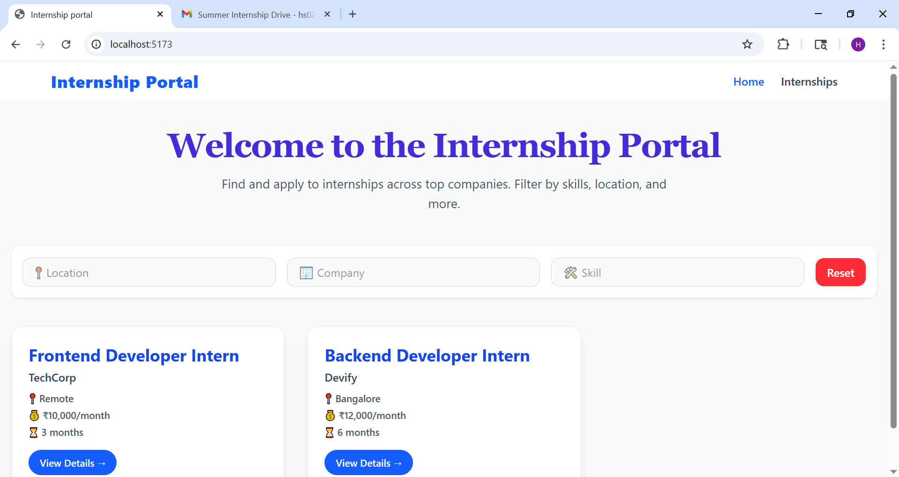

# 🚀 OneVarsity Projects - Himanshu Sharma

Welcome to the **OneVarsity Assignment Repository** containing two modern and responsive React projects built by **Himanshu Sharma**:

- 🧑‍💻 **Assignment 1: Portfolio Dashboard**
- 🎓 **Assignment 2: Internship Portal**

Both projects use **React**, **Redux Toolkit**, and **Tailwind CSS** for a performant, stylish, and responsive experience. Each is deployed on GitHub Pages for live preview.

---

## 📂 Project Structure
```
onevarsity/
└── himanshu/
├── assignment1/ # Portfolio Dashboard
└── assignment2/ # Internship Portal
```
---

## 🔗 **Live Demo:** [Assignments page](https://hs024.github.io/onevarsity/)

## 📘 Projects Overview

### 🧑‍💻 Assignment 1: Portfolio Dashboard

A modern, responsive, and theme-toggleable personal portfolio dashboard.

🔗 **Live Demo:** [Portfolio Dashboard](https://hs024.github.io/PortFolio_Dashboard-himanshu/)

#### ✨ Features

- 🌓 Light/Dark Theme Toggle
- 🎨 Gradient background animations
- 📱 Fully responsive layout
- 🧭 Sidebar navigation
- 🧾 Sections: Overview, Projects, Contact
- 🔗 External links: GitHub, LinkedIn, LeetCode, etc.
- 🖼️ Image assets from `public/images`

#### 📁 Folder Structure
```
assignment1/
├── public/
│ └── images/
│ └── myphoto.jpg
├── src/
│ ├── components/
│ ├── features/
│ ├── sections/
│ ├── App.jsx
│ ├── main.jsx
│ └── index.css
├── tailwind.config.js
├── vite.config.js
```

#### 🛠️ Tech Stack

- **Frontend:** React + Vite
- **Styling:** Tailwind CSS
- **State Management:** Redux Toolkit
- **Deployment:** GitHub Pages

#### 🖼️ Preview


---

### 🎓 Assignment 2: Internship Portal

A clean and elegant internship portal that helps students find and apply to internships.

🔗 **Live Demo:** [Internship Portal](https://hs024.github.io/Internship-portal/)

#### ✨ Features

- 🏠 Home page with internship filters
- 🔍 Filter by location, company, or skill
- 📄 Internship detail view
- 🧾 Application form for students
- ⚙️ Redux-managed internship data and filters

#### 📁 Folder Structure
```
assignment2/
├── public/
│ └── index.html
├── src/
│ ├── components/
│ │ ├── ApplicationForm.jsx
│ │ ├── FilterBar.jsx
│ │ ├── Header.jsx
│ │ └── InternshipCard.jsx
│ ├── pages/
│ │ ├── ApplyPage.jsx
│ │ ├── Home.jsx
│ │ ├── InternshipList.jsx
│ │ └── InternshipDetail.jsx
│ ├── redux/
│ │ ├── internshipSlice.js
│ │ └── store.js
│ ├── App.jsx
│ ├── main.jsx
│ ├── mockData.js
│ └── index.css
├── package.json
├── vite.config.js
```

#### 🛠️ Tech Stack

- **Frontend:** React + Vite
- **Styling:** Tailwind CSS
- **State Management:** Redux Toolkit
- **Routing:** React Router DOM
- **Deployment:** GitHub Pages

#### 🖼️ Preview



---

## 🧑‍💻 Author

**Himanshu Sharma**  
- [LinkedIn](https://www.linkedin.com/in/hs024/)  
- [GitHub](https://github.com/hs024)  
- 📞 9315710482  
- ✉️ hs0242262@gmail.com  

---

## 📜 License

This repository is open-source and free to use for educational purposes.

